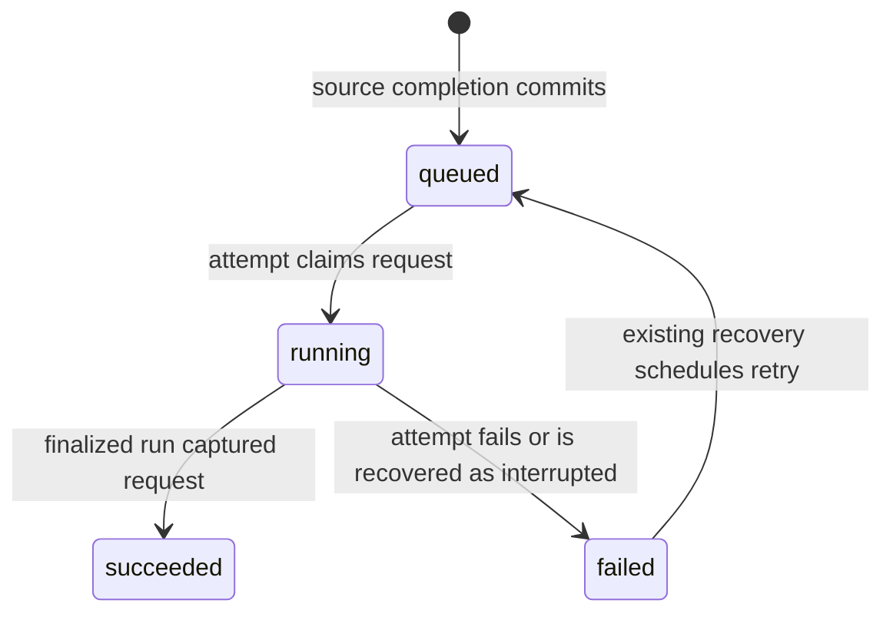

# Completed-sync coverage comes from captured work links

A completed source sync currently queues only a principal ID, leaving readers unable to prove which sync a calculation covers. Record durable calculation work with the exact completed source job, capture those links in the calculation's accounting input snapshot, and expose work separately from the active result. This extends the recorded-link rule in ADR 0012 and the versioned-run boundary in ADR 0007; BullMQ remains the dispatcher, not the durable source of coverage.

## Decision

- Source-job completion and its calculation request commit together. The request retains the principal, exact source job and source, and each requested jurisdiction/year/reporting-currency scope. Queue dispatch happens after commit; a lost dispatch leaves discoverable work for the existing maintenance path. Requests and attempts have their own identities: a request is not a calculation run and never uses invented engine versions or input revisions.
- The accounting input snapshot captures the exact committed requests/completion links it sees, in the same repeatable-read transaction that loads the factual ledger. The run retains these links immutably. A source replay read, a queue payload, a newer timestamp, or a changed run ID cannot establish coverage. A sync completing after the accounting snapshot remains outstanding for another run.
- Coverage answers whether a finalized complete or partial run consumed a snapshot that sees the named completed sync, within the requested scope. It does not certify that every raw record was accepted, all blockers are resolved, or later linked jobs have completed. Partial results retain their blockers. Existing movement-correction coverage still requires its own captured correction inputs and completed replay links under ADR 0013.
- Current work, a covering run, and the active result remain separate. A running or failed attempt never proves coverage. A finalized run that was not activated cannot certify the displayed active result. A later request cannot be settled by an earlier attempt that did not capture it. Duplicate dispatch and competing workers must not lose or falsely complete requests; durable failure and recovery remain observable.
- Scope means the requested annual result, not a restriction to that year's source history. Each annual calculation processes all available factual history before the end of that year, as ADR 0007 requires. There is no dependency on saved prior-year results. Sync-triggered scheduling retains the current DE/EUR year and existing active DE/EUR years; reading an unscheduled year does not enqueue work or imply that work is pending.
- Existing jobs and runs without recorded links have unknown coverage. Do not infer historical associations or backfill them from timestamps or row shape. Newly completed sync/replay work establishes new evidence through its normal writers. Account claims and non-sync triggers cannot masquerade as source jobs.

## Consequences

Which states describe a recorded calculation request, independently of the active result?

`not_requested` describes the absence of a request for the scope; it is not a stored request state. Dispatch failure leaves a queued request. A new sync creates a separate request, rather than changing a successful request back to queued. A succeeded request can still have an uncovered active result if its covering run was not activated.

Clients can rediscover selected-year pending work after reload while retaining the last active result. They compare the returned active run ID with the result they actually display before using its coverage. No reader recalculates money, changes an active run's accounting status, or treats coverage as proof of tax correctness.

The existing calculation queue and maintenance loop gain durable request handling; this is not a second scheduler. Durable scope requests prevent coalesced principal jobs from dropping work accepted during an earlier calculation. Price-only and other new recompute triggers remain separately scoped work.

## Considered options

Using run timestamps or BullMQ state alone was rejected because neither proves visibility in the accounting snapshot, and queue retention or a crash can erase the evidence. Creating pending calculation runs at sync completion was rejected because the input revisions and engine invocation do not exist yet. Reusing saved prior-year lots was rejected because it would replace the full recompute model with derived opening state.
